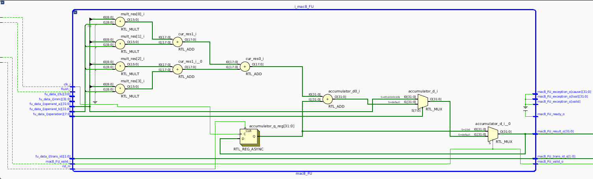

# mac8_FU 

## Description 
 mac8_FU is a SIMD multiply and accumulate (MAC) unit with
 internal accumulator register. It has a fix latency of one cycle.  Multiplications are computed on 8 bits value (hence the 8 in its
 name). 

 mac8_FU performs two main operations : 
   - MAC8_INIT : initialize the accumulator with operand_a value.
   - MAC8_ACC  : compute mac on operand_a and operand_b vectors and
                 add the result to the accumulator register.
mac8_FU outputs the next value that will be stored in the accumulator.

Following implementation assumes vectors (operand_a, operand_b) of 32 bits
width. 
At this moment, only signed vs unsigned multiplications are done. It can be
extended by adding a sign-extension stage before multiplications.

## ASM INSTRUCTIONS 

mac8_FU instructions use Custom-0 opcode and rtype format.

| instructions |     funct7    | rs2 | rs1 | funct3 | rd  |    Opcode    |
|--------------|---------------|-----|-----|--------|-----|--------------|
| mac8_init    |  7'b0000_000  |  -  |  -  | 3b'010 |  -  | 7'b00_010_11 |
| mac8_acc     |  7'b0000_000  |  -  |  -  | 3b'000 |  -  | 7'b00_010_11 |

##  TODO : 
 - speculative execution !!! move register writing to commit stage
 - handle the accumulator overflow 
   simple solution : 
   - raise exception when an overflow occurs
   - increase the accumulator size and define lower | upper part ?
## LICENCE

Copyright 2023-2024 INSA Toulouse.  
Copyright and related rights are licensed under the Solderpad Hardware
License, Version 0.51 (the "License"); you may not use this file except in
compliance with the License.  You may obtain a copy of the License at
http://solderpad.org/licenses/SHL-0.51. Unless required by applicable law
or agreed to in writing, software, hardware and materials distributed under
this License is distributed on an "AS IS" BASIS, WITHOUT WARRANTIES OR
CONDITIONS OF ANY KIND, either express or implied. See the License for the
specific language governing permissions and limitations under the License.

Date   : 11.05.2024
